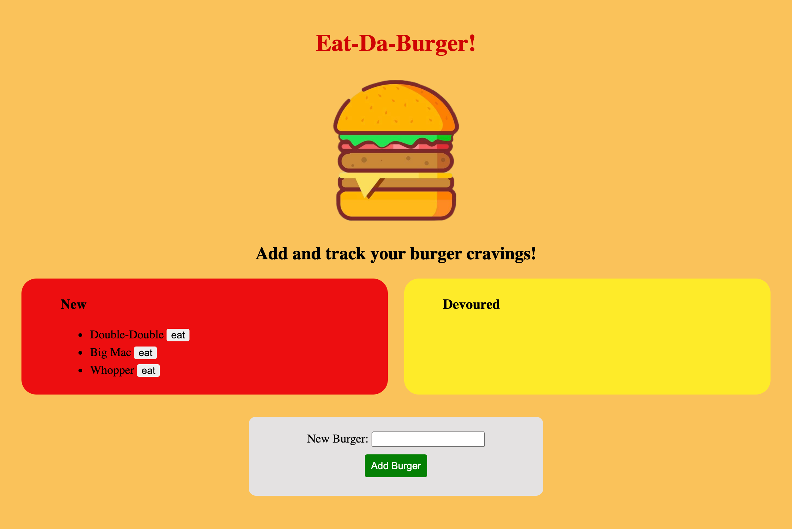

# Homework 13: Eat-Da-Burger! (Express Handlebars)

## Description
This website application allows a user to create new burgers and update whether they have been devoured or not. It allows this by accessing a database while using an MVC structure.

## Deployed Application (Heroku)
<a href="https://stormy-temple-07121.herokuapp.com/">Eat-Da-Burger!</a>

## Credits
* HTML
* CSS
* Javascript
* Jquery
* Node.js
* Express
* Express-handlebars
* MySQL
* Heroku

## Portfolio
<a href="https://kdoh52.github.io/">Updated portfolio</a>

## Contact
* kdoh52@gmail.com
